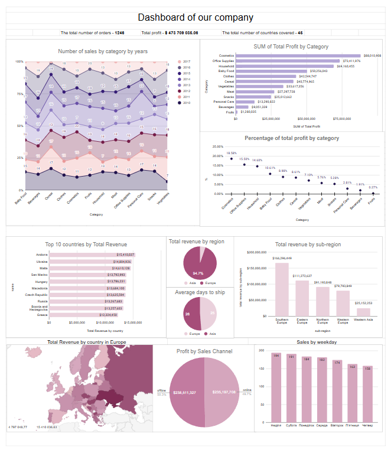
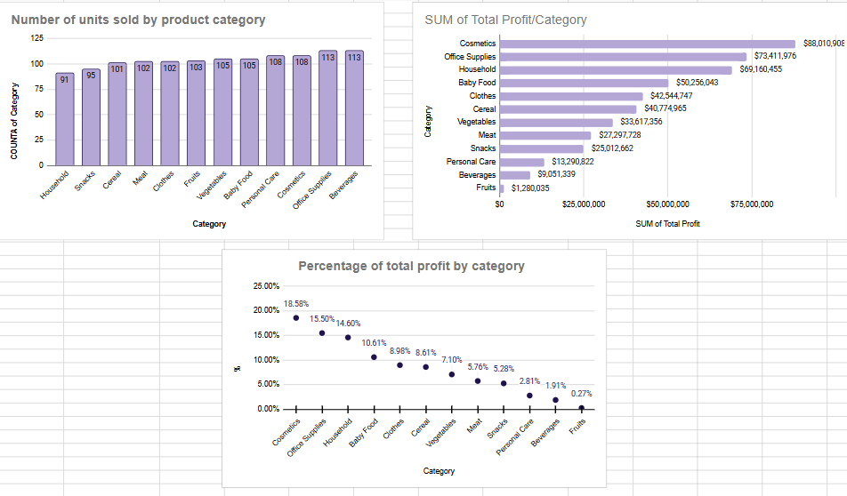
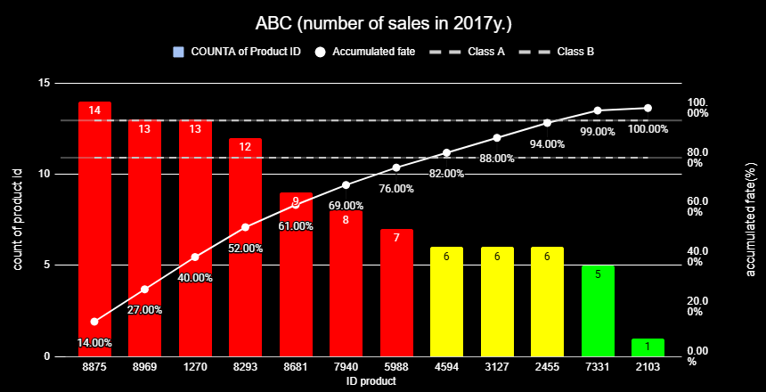
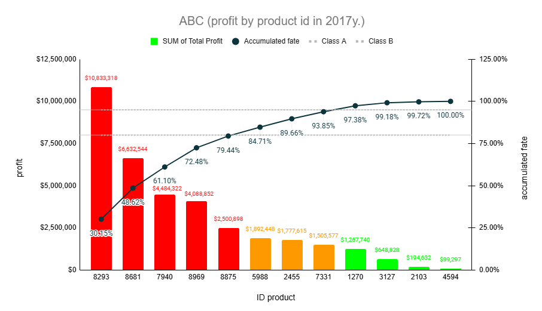

# 📊 Global Sales Analysis — Excel Project

## Мета проєкту
Комплексний аналіз продажів міжнародної компанії 
яка реалізує товари онлайн та офлайн на світовому ринку.
Аналіз охоплює категорії товарів, географію, 
канали збуту, логістику та динаміку продажів.

## Файли
- `analysis.xlsx` — повний аналіз в Google Sheets
 [Sales Analysis](https://docs.google.com/spreadsheets/d/1ukkBHs9u8lgVkC7a1Zv4KohIoO-gYhsOtPFUldc11SE/edit?gid=0#gid=0)
- `images/` — графіки та дашборд

## Дані
Три таблиці:
- **Events** — продажі за декілька років
- **Products** — категорії товарів та їх коди  
- **Countries** — країни, регіони та їх коди

Загальна статистика:
- 1,246 замовлень
- 45 країн
- 13 категорій товарів
- Загальний прибуток: $473,709,035

## Інструменти
- Google Sheets (аналіз, зведені таблиці, візуалізація)
- ABC-аналіз за принципом Парето

## Що зроблено

### 1. Підготовка даних
- Імпорт трьох таблиць в Google Sheets
- Перевірка якості даних — пропуски, аномалії
- Додано розрахункові стовпці: 
  Total Revenue, Total Cost, Total Profit

### 2. Ключові метрики
- Загальна кількість замовлень, прибуток, охоплені країни

### 3. Аналіз по категоріях
- Топ-3 категорії за прибутком: Cosmetics, 
  Office Supplies, Household (48.7% прибутку)
- Топ-3 за кількістю замовлень: Cosmetics, 
  Office Supplies, Beverages

### 4. Географічний аналіз
- 94% прибутку — Європа
- Південна Європа — 35% від загального прибутку
- Топ країни: Україна, Андора, Мальта, 
  Сан-Марино, Угорщина

### 5. Канали збуту
- Онлайн-продажі ефективніші та прибутковіші 
  ніж офлайн

### 6. Логістика
- Час доставки: від 0 до 40+ днів
- Середній час: 25 днів
- Виявлено затримки які впливають на 
  задоволення клієнтів

### 7. Динаміка продажів
- Аналіз по роках, місяцях, днях тижня
- Аналіз в розрізі категорій, країн, регіонів

### 8. ABC-аналіз (принцип Парето)
- Категорія A — 70-80% виторгу і прибутку
- Категорія C — велика кількість товарів 
  з мінімальним впливом

## Ключові висновки
1. Фокус ресурсів на категорії A товарів — 
   вони генерують основний прибуток
2. Оптимізувати логістику — скоротити 
   середній час доставки з 25 днів
3. Розвивати онлайн-канал як ключовий 
   драйвер зростання
4. Південна Європа — пріоритетний ринок 
   для розширення

## Дашборд

## Аналіз по категоріям

## АВС аналіз по к-сті замовлення товару

## АВС аналіз по доходу з товарів

